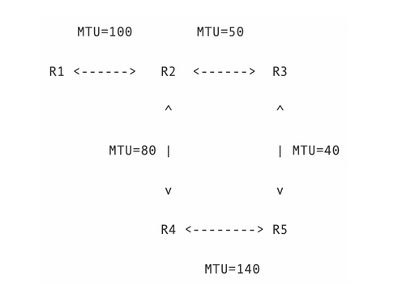

# Mini Internet

Mini internet simulation for the course CC4303 Computer Networks at the University of Chile

## Project Structure

The project consists of three folders: BGP, Forwarding and Fragmentation. These folders implement different functionalities related to the Network layer of the OSI model.

## Forwarding

This folder implements router forwarding, where each router has a routing table that it uses to forward IP packets accordingly. In this simplification, each routing table line is of the form 

```
[Initial IP] [Initial Port] [Final Port] [Hop IP] [Hop Port]
```

Using this structure, a router will check if an ip packet falls in the port range specified in the routing table line. If so, it forwards the packet to the router on `[Hop IP]:[Hop Port]`. Each router also implements round robin to cycle between different possible routes from one router to another, the `router_ttl` code implements a Time-to-Live (TTL), dropping packets if its TTL reaches 0. 

To run the routers, run `python run_all.py <NUM_ROUTERS> <VERSION> <TTL>`. The first argument specifies how many routers to initialize, the version is a string which corresponds to the folder containing the routing tables, and the third argument specifies whether to use TTL or not. Once the routers have been initialized, `netcat` can be used to send messages to the router. The routers expect messages of the form

```
IP,Port,Message
```

For example, if we wanted to send a message to a router on 127.0.0.1:8881, we would need to first run `netcat -u 127.0.0.1 8881` and then the message `127.0.0.1,8881,hello!`. If TTL is used, the message should be 

```
IP,Port,TTL,Message
```

## Fragmentation

This folder adds IP packet fragmentation on top of the forwarding already implemented. To do this, the routing tables are modified to include the Maximum Transmission Unit (MTU) between two routers. The idea is that if we try to forward a packet from one router to another whose size in bytes is larger than the MTU of that link, that packet must first be fragmented. Once the packet is fragmented, each fragment is sent to the destination router, and this router is in charge of reassembling the fragments. 

For this part, the router structure is as follows:

<p align='center'>
    
</p>

To run the routers with fragmentation, run `python run_all.py <NUM_ROUTERS>` passing the number of routers to run. Again, use `netcat` to send messages to the routers. The difference is that now the routers expect messages of the form

```
IP,Port,TTL,ID,Offset,Size,Flag,Message
```

Here ID is a random integer, and Offset and Flag should be set to 0 when sending messages with `netcat`. The routers modify these values internally when fragmenting packets. The Size value corresponds to the size of the message in bytes, and should always be 8 digits. For example, if our message was 300 bytes long, the Size would be 00000300. If we wanted to send the message 'hello!' from router 1 to router 5, we would first run `netcat -u 127.0.0.1 8881` and then send the message

```
127.0.0.1,8885,10,347,0,00000006,0,hello!
```

## BGP

This part of the project implements the Border Gateway Protocol (BGP). In this regard we will assume that each router is an Autonomous System (AS), thus each router participates in external BGP. Initially each router only knows its immediate neighbor, and after running the BGP algorithm each router will have routes to non-neighboring routers. The routing tables are now modified to the following structure:

```
[Initial IP] [AS Route] [Hop IP] [Hop Port] [MTU]
```

Here `AS Route` is of variable length, and indicates the route we would have to take to go from one AS to another and are in reverse order. For example, the AS route `8885 8883 8882 8881` would tell us that to go from AS 8881 to AS 8885, we would have to take the route `8881 -> 8882 -> 8883 -> 8885`. Considering this, the BGP algorithm runs as follows. 

1. First we send a START_BGP message to a router indicating that the BGP algorithm will start. This message is sent to the routers neighbors. 

2. After sending the START_BGP message, a BGP_ROUTES message is sent to all the neighbors, indicating the BGP routes that a router has. The BGP_ROUTES message looks like

```
BGP_ROUTES
888X
[AS Route]
...
[AS Route]
END_BGP_ROUTES
```

The first and last lines denote the start and end of a BGP message, the second line tells us which AS sent the BGP message, and the following lines contain the routes known by the AS that sent the message. 

3. When a neighbor receives a BGP message, it checks the routes contained in the message. If it checks a route it already has in its routing table, it does nothing, If the route is already present but is shorter than the one it currently has, it updates it to the shorter route. If it does not have a route, it adds it to the routing table. 

4. This continues until a router has checked all the routes received in the BGP message.  If after checking all of the routes received the router has has made a change to the routing table, it sends another BGP message with the new routes. 

5. This whole process is repeated until all of the routing tables stop changing. A 10 second timeout is set for each router, and after the timeout expires we can assume that no more routes will be sent and the BGP algorithm has ended.

After running BGP, the new routing tables are written to text files with the name `BGP_[AS].txt`. These routing tables are then used to handle IP packet forwarding as described in the Forwarding section.

To run the routers we use `netcat` as described previously. To start the BGP algorithm we send a message to any router with the message `START_BGP`. Once we send this message we must wait until we see messages saying `wrote routing table to ...` for each router. Once that happens we can send messages from any router to any other as seen previously.
